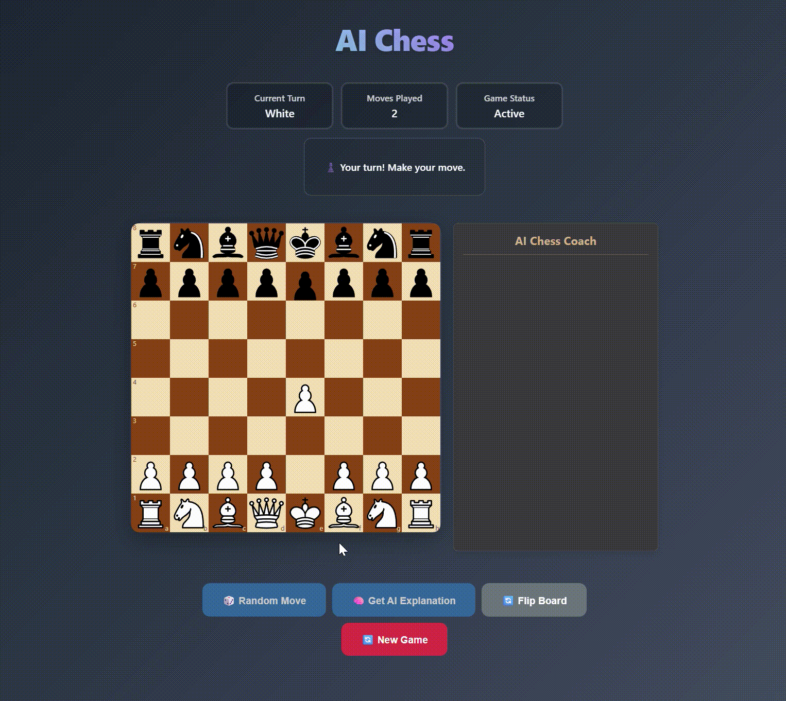

# AI Chess

## Demo

## Guide To Running Project

- Clone the project: `https://github.com/AryanB1/AIChess.git`
- Run the follow commands:
  - `cd frontend`
  - `npm install`
  - `npm run start`
  - Open a new terminal:
  - `cd backend`
  - `go build`
  - `./AIChess`
